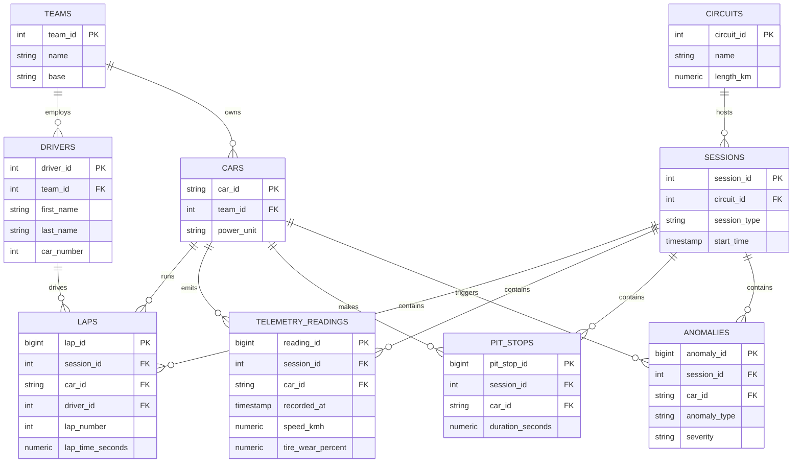
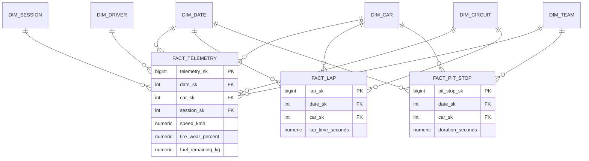

# Data Model

Two layers, both PostgreSQL (DDL in [`../sql/ddl`](../sql/ddl)):

1. **Operational (3NF)** - the source of truth for historical telemetry.
2. **Analytics (star schema)** - dimensional model built from the operational
   tables for fast aggregation and BI/Grafana.

## 1. Operational model (ERD)

## 2. Analytics model (star schema)

Conformed dimensions shared by all facts; surrogate keys (`_sk`) decouple the
warehouse from operational IDs and leave room for slowly-changing dimensions.

## 3. Design rationale

| Decision | Why |
|----------|-----|
| Split OLTP (3NF) and OLAP (star) | Normalised tables keep writes consistent and storage lean; the star schema makes analytical aggregations (avg lap time, tire wear over a stint, pit-stop duration by team) fast and BI-friendly. |
| Grain of `fact_telemetry` = one reading/car/timestamp | Finest useful grain; everything else (per-lap, per-stint, per-session) rolls up from it. |
| Surrogate keys on dimensions | Decouple analytics from source IDs; enable SCD Type 2 (e.g. a driver changing teams) without breaking facts. |
| `dim_date` (YYYYMMDD) | Standard date dimension for time-series rollups and Grafana time filters. |
| Index `telemetry_readings (session_id, car_id, recorded_at)` and `fact_telemetry (date_sk, car_sk, session_sk)` | The dominant query pattern is "a car's telemetry over time in a session". |
| PostgreSQL (RDS) | Already used by Airflow; managed, encrypted, point-in-time recovery. For multi-month, high-cardinality telemetry, TimescaleDB / a columnar warehouse (BigQuery, ClickHouse) is the next step. |

The real-time path (Prometheus + Grafana) covers short windows; this relational
model is the durable historical/analytical store, loaded by the Airflow batch DAG.
